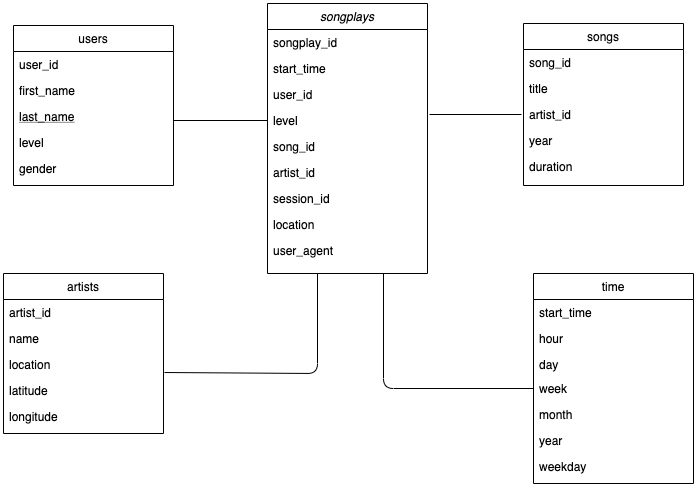
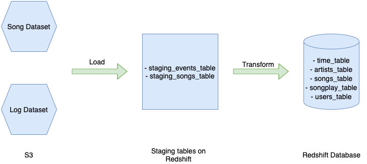

### Purpose

This project is to build an ETL pipline that extracts Sparkify data from S3, stages them in Redshift, and transforms data into a set of dimensional tables which could improves the speed and efficiency of accessing large data sets and makes it easier for Sparkify's analytics team to continue finding insights in what songs their users are listening to. 

### Database Schema - Star Schema

The database includes the following tables:

**Fact Table**
1. songplays - records in log data associated with song plays i.e. records with page NextSong
    - songplay_id, start_time, user_id, level, song_id, artist_id, session_id, location, user_agent

**Dimension Tables** 

2. users - users in the app
    - user_id, first_name, last_name, gender, level
    
3. songs - songs in music database
    - song_id, title, artist_id, year, duration
    
4. artists - artists in music database
    - artist_id, name, location, latitude, longitude

5. time - timestamps of records in songplays broken down into specific units
    - start_time, hour, day, week, month, year, weekday
   

### ETL Piplines

### Project Guideline

The project repository includes four files:

1. README.md project overview

2. create_tables.py creates fact and dimension tables for the star schema in Redshift.

3. etl.py reads and runs sql queries that load data from S3 into staging tables on Redshift and then process that data into analytics tables on Redshift database.

4. sql_queries.py contains all sql queries, and is imported into the last two files above.

***How to use***

     Step 1: read file README.md to get an overview about the project.
     
     Step 2: open a new terminal window and run file create_tables.py to drop existing tables a create new ones.
     
     Step 3: run file etl.py to load and transform data from S3 to Redshift database.
     
     